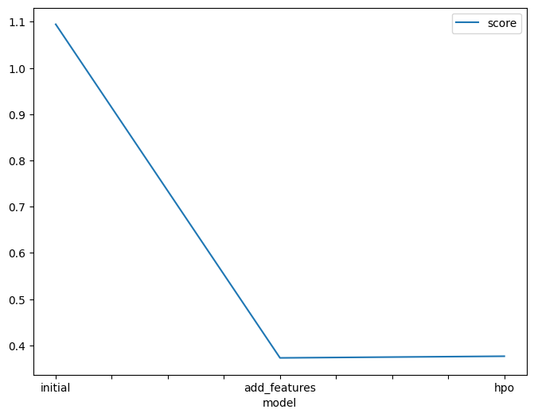
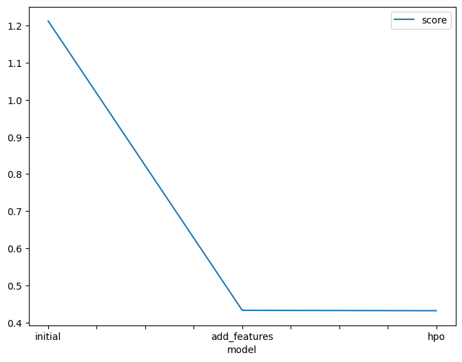

# 🚲 Report: Predict Bike Sharing Demand with AutoGluon Solution  
#### Jana Albader

## Initial Training
### What did you realize when you tried to submit your predictions? What changes were needed to the output of the predictor to submit your results?
The initial predictions from the model included negative values, which are not valid for bike counts. Kaggle rejected the first submission because of this. I applied a `np.log1p` transformation on the target variable before training, and then used `np.expm1` after prediction to reverse the log. Additionally, I clipped any remaining negative predictions to zero to ensure the submission was valid.

---

### What was the top ranked model that performed?
The best-performing model based on validation score was WeightedEnsemble_L3, an ensemble model generated automatically by AutoGluon. It combined predictions from other strong base models like CatBoost and LightGBMXGB, and achieved the lowest RMSE of 0.37659 on the internal validation set. On the Kaggle test set, this model achieved a final RMSE of 0.43194, making it the best model overall.

---

## Exploratory data analysis and feature creation
### What did the exploratory analysis find and how did you add additional features?
Exploratory data analysis showed clear patterns in bike usage based on time and weather:
- Most rentals happened during rush hours and on working days.
- Temperature, windspeed, and humidity showed non-linear relationships with demand.

Based on these insights, I added the following new features:
- **`hour`**: extracted from the datetime.
- **`time_of_day`**: categorized into `morning_rush`, `lunch`, `evening_rush`, and `off_peak`.
- **`temp_cat`**: labeled as `cold`, `mild`, or `hot`.
- **`wind_cat`**: binned into `calm`, `breezy`, or `windy`.
- **`humidity_cat`**: binned into `dry`, `moderate`, or `humid`.

These features were encoded as categories to help tree-based models better capture discrete behavioral patterns.

---

### How much better did your model preform after adding additional features and why do you think that is?
After adding the new features, the Kaggle score improved from **1.21232** to **0.43297**. This significant improvement shows that the additional features helped the model understand temporal and environmental patterns more effectively. Categorizing continuous features allowed the model to generalize better and recognize important distinctions in user behavior.

---

## Hyper parameter tuning
### How much better did your model preform after trying different hyper parameters?
Hyperparameter tuning included adjusting:
- `iterations=700` for CatBoost
- `epochs=20` for NeuralNetTorch
- `extra_trees=True` for GBM

After tuning, the Kaggle score improved slightly to **0.43194** from **0.43297**. Although the improvement was small, it confirmed that fine-tuning hyperparameters can enhance performance, especially when already starting from a strong baseline.

---
### If you were given more time with this dataset, where do you think you would spend more time?
With more time, I would:
- Explore interaction terms (e.g., `hour × workingday`)
- Include rolling average or lag features for temperature and humidity
- Integrate external weather data or holiday indicators
- Try feature selection techniques to reduce noise
- Experiment with custom ensembling beyond AutoGluon's defaults

---

### Create a table with the models you ran, the hyperparameters modified, and the kaggle score.
| model         | hpo1             | hpo2       | hpo3              | score   |
|---------------|------------------|------------|-------------------|---------|
| initial       | default           | default    | default           | 1.21232 |
| add_features  | default           | default    | default           | 0.43297 |
| hpo           | iterations=700    | epochs=20  | extra_trees=True  | 0.43194 |

---

### Create a line plot showing the top model score for the three (or more) training runs during the project.

### Create a line plot showing the top kaggle score for the three (or more) prediction submissions during the project.

TODO: Replace the image below with your own.

## Summary

This project demonstrated how AutoGluon can deliver strong machine learning results with minimal manual modeling. The most impactful improvements came from domain-aware feature engineering, which dramatically reduced the prediction error. Hyperparameter tuning gave additional gains, proving valuable for fine-tuning. The final score of **0.43194** represents a significant improvement from the initial baseline of **1.21232**.

AutoML tools like AutoGluon, when combined with thoughtful data exploration, can match or exceed the performance of custom hand-built models in practical applications.
